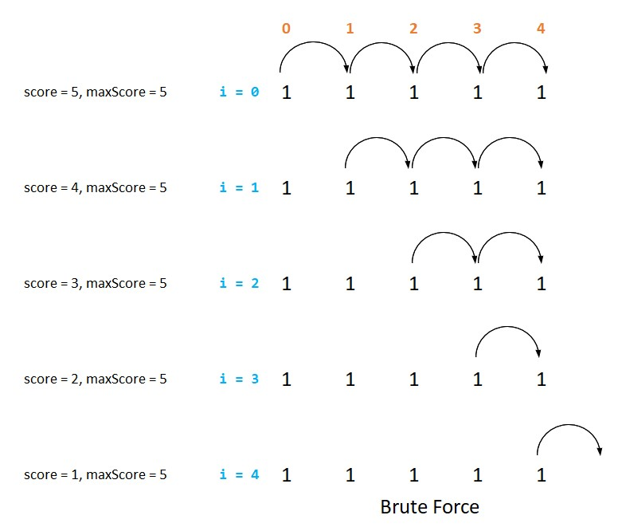

# Problem 1472C Long Jumps

<p align="center">
time limit per test: 2 seconds <br />
memory limit per test: 256 megabytes <br />
input: standard input <br />
output: standard output <br />
https://codeforces.com/contest/1472/problem/C
</p>

Polycarp found under the Christmas tree an array $a$ of $n$ elements and instructions for playing with it:

* At first, choose index $i (1≤i≤n)$ — starting position in the array. Put the chip at the index $i$ (on the value $a_i$).
* While $i≤n$, add $a_i$ to your score and move the chip $a_i$ positions to the right (i.e. replace $i$ with $i+a_i$).
* If $i>n$, then Polycarp ends the game.

For example, if $n=5$ and $a=[7,3,1,2,3]$, then the following game options are possible:

* Polycarp chooses $i=1$. Game process: $i=1 \xrightarrow{+7} 8$. The score of the game is: $a_1=7$.
* Polycarp chooses $i=2$. Game process: $i=2 \xrightarrow{+3} 5 \xrightarrow{+3} 8$. The score of the game is: $a_2+a_5=6$.
* Polycarp chooses $i=3$. Game process: $i=3 \xrightarrow{+1} 4 \xrightarrow{+2} 6$. The score of the game is: $a_3+a_4=3$.
* Polycarp chooses $i=4$. Game process: $i=4 \xrightarrow{+2} 6$. The score of the game is: $a_4=2$.
* Polycarp chooses $i=5$. Game process: $i=5 \xrightarrow{+3} 8$. The score of the game is: $a5=3$.

## Input
The first line contains one integer $t (1≤t≤10^4)$ — the number of test cases. Then $t$ test cases follow.

The first line of each test case contains one integer $n (1≤n≤2 \cdot 10^5)$ — the length of the array $a$.

The next line contains $n$ integers $a_1,a_2, … ,a_n (1≤a_i≤10^9)$ — elements of the array $a$.

It is guaranteed that the sum of $n$ over all test cases does not exceed $2 \cdot 10^5$.

## Output
For each test case, output on a separate line one number — the maximum score that Polycarp can get by playing the game on the corresponding array according to the instruction from the statement. Note that Polycarp chooses any starting position from $1$ to $n$ in such a way as to maximize his result.

## Examples
```
input
4
5
7 3 1 2 3
3
2 1 4
6
2 1000 2 3 995 1
5
1 1 1 1 1


output
7
6
1000
5

```
Note
The first test case is explained in the statement.

In the second test case, the maximum score can be achieved by choosing $i=1$.

In the third test case, the maximum score can be achieved by choosing $i=2$.

In the fourth test case, the maximum score can be achieved by choosing $i=1$.

## Solution
### Keywords: Dynamic Programming, Graphs, Recursion

### Brute Force
This is a simple case of Dynamic Programming problem. To start off, we can implement a brute force version which
* For each index $i$ starting from $0$ *performs the jump* and calculates the score for this $i$.
* Keeps track of the maximum score and prints the result.

The picture below shows how the walk happens for the first example


Looking above, we can see that the case for $i=3$, the jump from location $2$ is exactly same as the jump from the same location for the case of $i=2$.

So this means that we are repeatedly performing similar jumps and the problem becomes more apparent for the case when the given array is $[1, 1, 1, 1, 1]$ as shown in the picture below.



The code snippet below implements the brute force approach
```cpp
void problem_1472C_long_jumps_brute_force(std::vector<int>& nums) {
  uint64_t maxScore = 0;
  for (size_t i = 0; i < nums.size(); i++) {
    uint64_t thisRunScore = 0;
    int j = i; // start from current index
    while(j < nums.size()) { // jump across the array indices
      thisRunScore += nums[j];
      j += nums[j];
    }
    maxScore = std::max(maxScore, thisRunScore);
  }
  std::cout << maxScore << std::endl;
}
```
|                   |               |
| ----------------- | ------------- |
| Time Complexity   | $O(n^2)$      |
| Space Complexity  | $O(1)$        |

---

### Dynamic Programming
This leads to a better way of solving the problem
* Instead of walking left to to right, traverse right to left.
* In another array called $maxScores$, store the maximum score values if the jump were to start from that position, i.e. $maxScores[i]$ stores the maximum score if the jump were to start from position $i$.

This approach is precisely dynamic programming, because instead of repeatedly solving the same sub-problems and we are memoizing the intermediate results.

The picture below shows how the jumps look for an example


The code snippet below implements the dynamic programming approach
```cpp
void problem_1472C_long_jumps_dynamic_programming(std::vector<size_t>& nums) {
  size_t N = nums.size();
  std::vector<size_t> maxScores = nums;

  uint64_t maxScore = 0;
  for (int i = N - 1; i >= 0; i--) {
    if(i + nums[i] < N) {
      maxScores[i] += maxScores[i + nums[i]];
    }
    maxScore = std::max(maxScore,  maxScores[i]);
  }
  std::cout << maxScore << std::endl;
}
```

|                   |               |
| ----------------- | ------------- |
| Time Complexity   | $O(n)$        |
| Space Complexity  | $O(n)$        |

---
Here is the full code.
### Code
```cpp
#include <string>
#include <iostream>
#include <vector>

void problem_1472C_long_jumps_brute_force(std::vector<int>& nums) {
  uint64_t maxScore = 0;
  for (size_t i = 0; i < nums.size(); i++) {
    uint64_t thisRunScore = 0;
    int j = i; // start from current index
    while(j < nums.size()) { // jump across the array indices
      thisRunScore += nums[j];
      j += nums[j];
    }
    maxScore = std::max(maxScore, thisRunScore);
  }
  std::cout << maxScore << std::endl;
}

void problem_1472C_long_jumps_dynamic_programming(std::vector<size_t>& nums) {
  size_t N = nums.size();
  std::vector<size_t> maxScores = nums;

  uint64_t maxScore = 0;
  for (int i = N - 1; i >= 0; i--) {
    if(i + nums[i] < N) {
      maxScores[i] += maxScores[i + nums[i]];
    }
    maxScore = std::max(maxScore,  maxScores[i]);
  }
  std::cout << maxScore << std::endl;
}

int main() {
  int numTests = 0;;
  std::cin >> numTests;
  while (numTests--) {
    int arrayLength = 0;
    std::cin >> arrayLength;

    std::vector<size_t> nums;
    for (size_t i = 0; i < arrayLength; i++) {
      int num = 0;
      std::cin >> num;
      nums.push_back(num);
    }

    problem_1472C_long_jumps_dynamic_programming(nums);
  }
}


```
