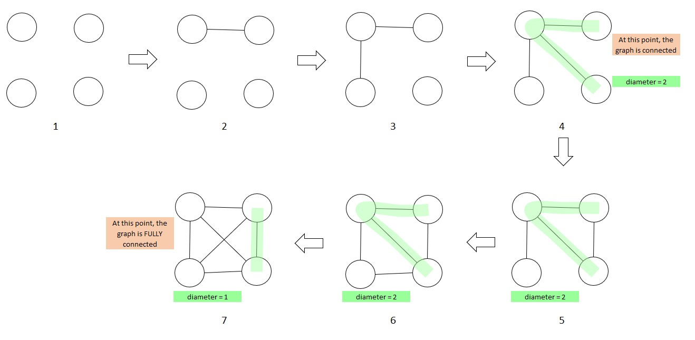

# Problem 1581B Diameter of Graph

<p align="center">
time limit per test: 1 second <br />
memory limit per test: 256 megabytes <br />
input: standard input <br />
output: standard output <br />
https://codeforces.com/problemset/problem/1581/B
</p>

CQXYM wants to create a connected undirected graph with $n$ nodes and $m$ edges, and the diameter of the graph must be
strictly less than $k−1$. Also, CQXYM doesn't want a graph that contains self-loops or multiple edges (i.e. each edge
connects two different vertices and between each pair of vertices there is at most one edge).

The diameter of a graph is the maximum distance between any two nodes.

The distance between two nodes is the minimum number of the edges on the path which endpoints are the two nodes.

CQXYM wonders whether it is possible to create such a graph.

## Input
The input consists of multiple test cases.

The first line contains an integer $t(1 ≤ t ≤ 10^5)$ — the number of test cases. The description of the test cases follows.

Only one line of each test case contains three integers $n(1≤n≤10^9), m, k (0≤m,k≤10^9)$.

## Output
For each test case, print $YES$ if it is possible to create the graph, or print $NO$ if it is impossible. You can print
each letter in any case (upper or lower).

## Examples
```
5
1 0 3
4 5 3
4 6 3
5 4 1
2 1 1

output
YES
NO
YES
NO
NO
```
Note
In the first test case, the graph's diameter equal to 0.

In the second test case, the graph's diameter can only be 2.

In the third test case, the graph's diameter can only be 1.

## Solution
### Keywords: Graphs
This is somewhat a tricky problem, basically the problem gives certain parameters of a graphs that we want, i.e, number
of nodes $n$, number of edges $m$ and upper bound on the diameter $k-1$ (it is weird that they choose to use $k-1$
instead of simply using $k$) and asks whether it is possible to construct such a graph.

One could attempt to construct all possible graphs with the given number of nodes $n$, number of edges $m$ and check
wheather there exists a graph whose diameter is strictly $< k-1$.

Although the above approach seems doable, it feels like an overkill for this problem, perhaps there is something simpler
that we can attempt.

Note the following points
1. We want the graph to be a **connected** graph, so we don't want lonely nodes, unless the graph has only one node.
2. We don't want self loops and multiple edges between nodes.
   * Given $n$ nodes, we need atleast $n-1$ edges to make the graph connected.
   * Given $n$ nodes, we can have at most ${n \choose 2}$ number of edges.

Look at the image below for $n=4$, as we keep adding more and more edges, graph $4$ is when it becomes
connected, at which point the diameter is defined and is $2$. From this point onward adding more edges has
no effect on the diameter, until the graph becomes **fully connected** at which point the diameter becomes
$1$. The green path indicates the path of the diameter.

So, the possible values of the diameter are $0$ (only if $n=1$), $1$ or $2$



In the code snippet below
```cpp
// we want the graph to be a 'connnected graph'
if(numEdges < numNodes - 1 or
   numEdges > numEdgesInFullyConnectedGraph) {
  std::cout << "NO" << std::endl;
  return;
}
```

The condition `numEdges < numNodes - 1` is when we have too few edges and the condition `numEdges > numEdgesInFullyConnectedGraph` is when we have too many edges.

The reason why we have `int64_t diameter = k - 2;` is that the problem wants $diameter < k - 1$, it is simply easier to
deal with $diameter <= some value$, with the modified $k$

### Code
```cpp
#include <string>
#include <iostream>
#include <vector>
#include <algorithm>
#include <numeric>

void problem_1581B_diameter_of_graph(int64_t numNodes, int64_t numEdges, int64_t diameterLessEqualThan) {
  int64_t numEdgesInFullyConnectedGraph = (numNodes * (numNodes - 1)) / 2;

  // we want the graph to be a 'connnected graph'
  if(numEdges < numNodes - 1 or
     numEdges > numEdgesInFullyConnectedGraph) {
    std::cout << "NO" << std::endl;
    return;
  }

  // corner case
  if(numNodes == 1 and diameterLessEqualThan == 0) {
    std::cout << "YES" << std::endl;
    return;
  }

  // At this point we can assume that the graph is a 'connected graph'
  if(diameterLessEqualThan >= 2 or
     diameterLessEqualThan == 1 and numEdges == numEdgesInFullyConnectedGraph) {
    std::cout << "YES" << std::endl;
    return;
  }
  std::cout << "NO" << std::endl;
}

int main() {
  int numTests = 0;;
  std::cin >> numTests;
  std::vector<int> data;
  while (numTests--) {
    int64_t numNodes, numEdges, k;
    std::cin >> numNodes >> numEdges >> k;
    int64_t diameter = k - 2; // since we want diameter to be strictly less than k - 1
    problem_1581B_diameter_of_graph(numNodes, numEdges, diameter);
  }
}

```
