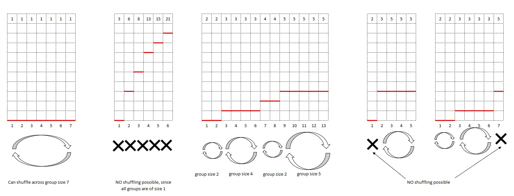

# Problem 1691B Shoe Shuffling

<p align="center">
time limit per test: 1 seconds <br />
memory limit per test: 256 megabytes <br />
input: standard input <br />
output: standard output <br />
</p>

A class of students got bored wearing the same pair of shoes every day, so they decided to shuffle their shoes among
themselves. In this problem, a pair of shoes is inseparable and is considered as a single object.

There are $n$ students in the class, and you are given an array $s$ in **non-decreasing order**, where $s_i$ is the shoe
size of the $i$-th student. A shuffling of shoes is valid only if **no student gets their own shoes** and if every
student gets shoes of size **greater than or equal to** their size.

You have to output a permutation $p$ of $\{1,2,…,n\}$ denoting a valid shuffling of shoes, where the $i$-th student gets
the shoes of the $p_i$-th student $(pi≠i)$. And output $−1$ if a valid shuffling does not exist.

A permutation is an array consisting of $n$ distinct integers from $1$ to $n$ in arbitrary order.
For example, $[2,3,1,5,4]$ is a permutation, but $[1,2,2]$ is not a permutation ($2$ appears twice in the array) and
$[1,3,4]$ is also not a permutation ($n=3$ but there is $4$ in the array).

## Input
Each test contains multiple test cases. The first line contains a single integer $t (1≤t≤1000)$ — the number of test
cases. Description of the test cases follows.

The first line of each test case contains a single integer $n (1≤n≤10^5)$ — the number of students.

The second line of each test case contains $n$ integers $s_1,s_2,…,s_n (1≤s_i≤10^9$, and for all $1≤i<n, s_i≤s_i+1)$ — the shoe
sizes of the students.

It is guaranteed that the sum of $n$ over all test cases does not exceed $10^5$.

## Output
For each test case, print the answer in a single line using the following format.

If a valid shuffling does not exist, print the number $−1$ as the answer.

If a valid shuffling exists, print n space-separated integers — a permutation $p$ of $1,2,…,n$ denoting a valid
shuffling of shoes where the $i$-th student gets the shoes of the $p_i$-th student. If there are multiple answers,
then print any of them.

## Example
```
input
2
5
1 1 1 1 1

6
3 6 8 13 15 21

output
5 1 2 3 4
-1
```

Note
In the first test case, any permutation $p$ of $1,…,n$ where $p_i≠i$ would represent a valid shuffling since all students
have equal shoe sizes, and thus anyone can wear anyone's shoes.

In the second test case, it can be shown that no valid shuffling is possible.

## Solution
Key points which leads to the solution are
1. The shoe sizes are given in increasing order
2. **Every** person should get a new pair of shoes
3. If  the given shoe sizes are in strictly increasing order (no flat portions), like the second example, there exists
   no permutation.

These lead to key ideas
1. The shoe sizes should be made of flat regions where sizes are same, it is in those regions where we can permute.
2. If we call the flat regions where the shoe sizes are same as a *group* then each *group* must be atleast 2 wide.


